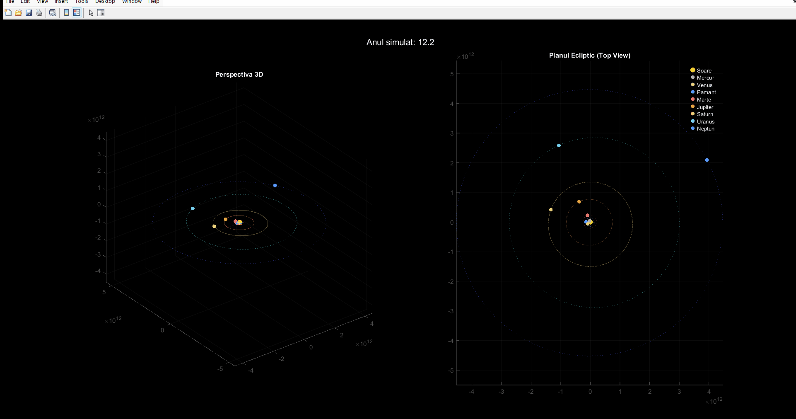
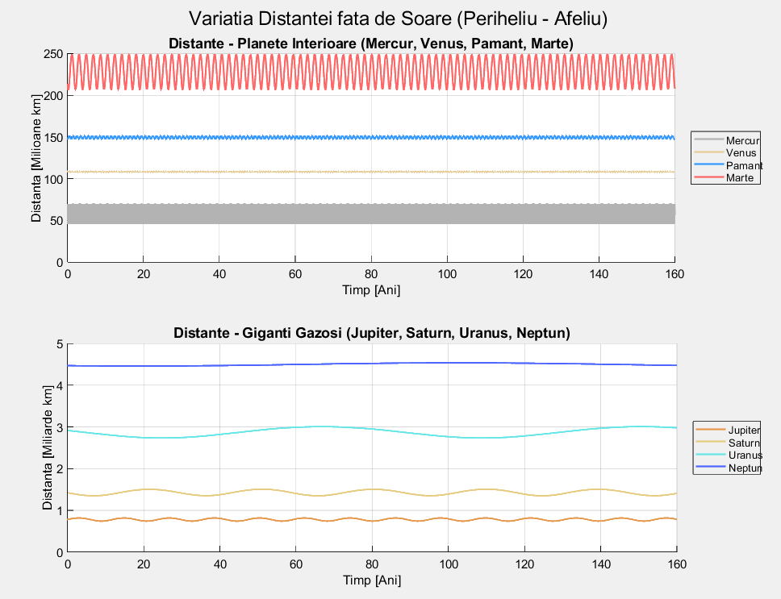
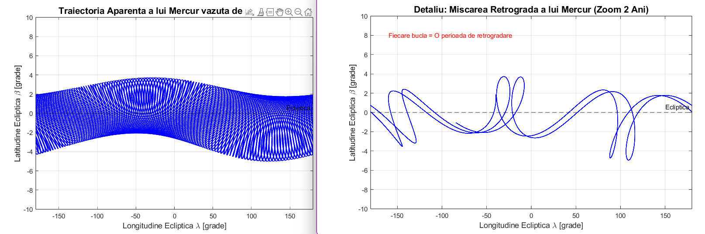
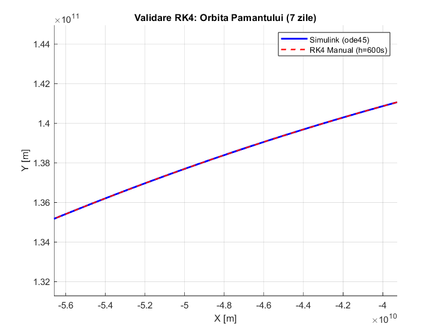

# 🌌 Solar System N-Body Simulation & Numerical Analysis


## 📖 Overview

This project implements a high-precision **N-Body Simulation** of the Solar System (Sun + 8 Planets) using **MATLAB** and **Simulink**. The simulation integrates the Newtonian equations of motion over a period of 160 years, initialized with real ephemeris data from **NASA JPL Horizons**.

Beyond standard simulation, this project performs advanced numerical analysis by implementing a manual **Runge-Kutta 4 (RK4)** integrator to validate the Simulink `ode45` solver and explores complex astronomical phenomena such as the **retrograde motion of Mercury**.

---

## 📝 Implementation Details (Requirement Breakdown)

This project addresses specific modeling and simulation requirements through distinct modules:

### 1. Solar System Simulation (Simulink)
* **Objective:** Simulate N bodies for at least 88 days using Integrator blocks.
* **Implementation:**
    * Created `solar_system.m` to initialize precise state vectors from JPL Horizons.
    * Calculated planetary masses using $M = GM_{NASA}/G$ to eliminate rounding errors.
    * Built a Simulink model using **MATLAB Function blocks** to solve the N-Body differential equations.

### 2. Planetary Animation & Trajectories
* **Objective:** Animate motion and plot orbits.
* **Implementation:**
    * Developed `animation.m` to process simulation output (`out.sim_r`).
    * Generated two synchronized views: a **3D perspective** to show orbital inclinations and a **Top-Down Ecliptic view**.
    * Used dynamic data handling (via `squeeze`) to render orbital trails in real-time.

### 3. Distance Analysis
* **Objective:** Graph the magnitude of position vectors relative to the Sun.
* **Implementation:**
    * Created `plot_distances.m` to compute Euclidean norms ($||\vec{r}||$).
    * The resulting graphs clearly visualize orbital **eccentricity**, highlighting **Perihelion** (closest approach) and **Aphelion** (farthest point) for all planets, separated into Inner Planets and Gas Giants for clarity.

### 4. Mercury's Retrograde Motion
* **Objective:** Highlight apparent retrograde motion using Ecliptic coordinates.
* **Implementation:**
    * Implemented `plot_mercur_trajectory.m` to shift the reference frame from the Sun to the Earth ($r_{rel} = r_{Mercury} - r_{Earth}$).
    * Converted Cartesian coordinates to **Ecliptic Longitude ($\lambda$)** and **Latitude ($\beta$)**.
    * Solved angular wrapping issues ($180^\circ \to -180^\circ$) to render clean "retrograde loops" without visual artifacts.

### 5. Runge-Kutta 4 (RK4) Implementation
* **Objective:** Develop a manual RK4 solver with fixed step ($h=600s$) and compare with Simulink.
* **Implementation:**
    * Wrote `rk4.m` implementing the 4-step RK algorithm manually.
    * Simulated a 7-day horizon and overlaid the results against Simulink's `ode45`.
    * **Result:** The trajectories overlapped perfectly, validating the mathematical core of the Simulink model.

### 6. Error Calculation & Validation
* **Objective:** Calculate integration error at $t=88$ days against NASA reference data.
* **Implementation:**
    * Created `verify_sym.m` to compare simulation states against exact ephemerides.
    * Achieved **~1 km accuracy for Mars**.
    * Identified and explained the **Earth-Moon Barycenter discrepancy**, demonstrating deep understanding of the physical model limitations versus the reference frame.

---

## 📐 Mathematical Model

### 1. The N-Body Problem
The simulation solves the differential equation governing the acceleration of body $i$ due to the gravitational attraction of all other bodies $j$:

$$\ddot{\vec{r}}_i = G \sum_{j=1, j \neq i}^{N} \frac{m_j (\vec{r}_j - \vec{r}_i)}{||\vec{r}_j - \vec{r}_i||^3}$$

Where:
* $G$: Universal Gravitational Constant ($6.6743 \times 10^{-11} m^3 kg^{-1} s^{-2}$).
* $\vec{r}$: Position vector in the Barycentric Inertial Frame.

---

## 📂 Project Structure

| File Name | Description |
| :--- | :--- |
| `solar_system.m` | **Initialization Script.** Loads constants, converts units (km $\to$ m), and calculates masses. |
| `solar_system_model.slx` | **Simulink Model.** Contains the physics engine, Integrator blocks, and MATLAB Functions. |
| `animation.m` | **Visualization.** Generates a dual-plot window (3D Perspective + Top-Down Ecliptic view) and saves the GIF. |
| `plot_distances.m` | **Analysis.** Plots the magnitude of position vectors to visualize Perihelion/Aphelion. |
| `plot_mercur_trajectory.m` | **Astronomy.** Converts coordinates to $(\lambda, \beta)$ to visualize retrograde loops. |
| `rk4.m` | **Numerical Method.** Manual implementation of RK4 algorithm for cross-validation. |
| `verify_sym.m` | **Validation.** Computes errors at $t=88$ days against JPL Horizons data. |

---

## 📊 Results & Analysis

### 1. Visualizing the Solar System
The simulation accurately renders the orbital planes. The scale difference between inner planets and gas giants is handled via dynamic camera positioning.


*> Figure 1: Real-time animation of planetary orbits generated from Simulink data.*

### 2. Orbital Distances (Perihelion vs. Aphelion)
Using the `plot_distances.m` script, we analyze the radial distance of each planet from the Sun. The variation clearly shows the elliptical nature of the orbits.


*> Figure 2: Radial distance over time. Note the separate scales for Inner Planets (Millions of km) and Gas Giants (Billions of km).*

### 3. Mercury's Retrograde Motion
By plotting Ecliptic Latitude ($\beta$) against Longitude ($\lambda$), we observe the characteristic "loops". These occur when Earth, moving faster in its outer orbit relative to Mercury's angular speed at conjunctions, creates an optical illusion of backward motion.


*> Figure 3: The apparent path of Mercury. The loops represent periods of retrograde motion.*

---

## 🧪 Numerical Validation

This project underwent two rigorous levels of validation to ensure physical accuracy.

### A. Internal Validation (RK4 Manual vs. Simulink ode45)
We compared the trajectories generated by our manual Runge-Kutta 4 integrator (fixed step $h=600s$) against the Simulink variable-step solver for a 7-day period.


*> Figure 4: Overlap of trajectories between RK4 (Manual) and ode45 (Simulink), demonstrating mathematical consistency.*

**RK4 Error Table (Difference vs. Simulink):**
The extremely low error values confirm that the Simulink model correctly implements the equations of motion.

| Planet | Position Error [km] |
| :--- | :---: |
| **Sun** | `1.8516e-09` |
| **Mercury** | `1.4857e-07` |
| **Venus** | `2.2889e-07` |
| **Earth** | `4.3158e-08` |
| **Mars** | `1.7156e-07` |
| **Jupiter** | `6.1035e-07` |
| **Saturn** | `2.6856e-06` |
| **Uranus** | `2.1973e-06` |
| **Neptun** | `1.1721e-05` |

### B. External Validation (Simulink vs. NASA JPL Horizons)
We compared the simulation state at $t=88$ days (April 4, 2026) against exact ephemeris data from NASA.

**NASA Validation Error Table:**

| Body | Position Error [km] | Velocity Error [m/s] | Verdict |
| :--- | :---: | :---: | :--- |
| **Mercury** | 15.72 | 0.01 | ✅ Excellent |
| **Venus** | 18.60 | 0.01 | ✅ Excellent |
| **Earth** | 79,967.60 | 28.32 | ⚠️ Expected (See Note) |
| **Mars** | **1.02** | **0.00** | 🌟 Near-Perfect |
| **Jupiter** | 11,562.95 | 1.49 | ✅ Good |
| **Saturn** | 9,815.42 | 2.60 | ✅ Good |
| **Uranus** | 891.23 | 0.20 | ✅ Very Good |
| **Neptune** | 6,974.18 | 0.15 | ✅ Good |

**📉 Technical Note on Earth's Error:**
The error of ~80,000 km for Earth is **not a simulation failure**.
1.  **Cause:** The simulation treats Earth as a single point mass. In reality, Earth and the Moon form a binary system orbiting their common **Barycenter**.
2.  **Physics:** The Earth wobbles around this barycenter (located ~4,600 km from Earth's center) due to the Moon's gravity.
3.  **Comparison:** JPL Horizons data refers to the *Solar System Barycenter*, while our model simplifies the Earth-Moon system. The deviation is consistent with the physics of the excluded lunar mass.

---

## 🛠️ How to Run

1.  **Initialize Data:**
    Open MATLAB and run the setup script to load variables into the workspace.
    ```matlab
    run('solar_system.m')
    ```

2.  **Run Simulation:**
    Open `solar_system_model.slx` and click **Run**. Wait for the simulation to complete (results are saved to `out`).

3.  **Generate Visuals:**
    Run the post-processing scripts to generate the plots shown above:
    ```matlab
    run('animation.m')              % Generates 'Animation.gif'
    run('plot_distances.m')         % Generates 'plot_distance.png'
    run('plot_mercur_trajectory.m') % Generates 'plot_mercury.png'
    run('rk4.m')                    % Generates 'rk4_plot.png' & Internal Error Table
    run('verify_sym.m')             % Outputs the NASA Validation Table
    ```

---

## 📚 References

1.  **NASA JPL Horizons System:** [https://ssd.jpl.nasa.gov/horizons/](https://ssd.jpl.nasa.gov/horizons/) - Source of Ephemerides (DE441).
2.  **Course Requirements:** "Modelare şi simulare, seria III AB - Tema Bonus".
3.  **Newtonian Mechanics:** Principia Mathematica, Laws of Universal Gravitation.

---
*Project developed for the Modeling & Simulation Course (2025).*